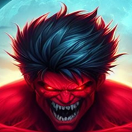

# Smashers

## Description:
The code for a Fighting Game made in Unreal Engine 5.2.1 for The Rookies Awards 2024

## Features:
All customizable:

- Character Roster and Selection SubSystem
- Map Roster and Selection SubSystem
- Gamemode Roster and Selection Subsystem
- Fighting System
- Local Multiplayer
- Save Data SubSystem
- Menu System
- HUD
- HealthSystem
- HitBox System
- AI Controlled Fighter
  
## How to Use:
0. Create a Unreal Engine project
1. Copy Source classes and import HUD plugin
2. Setup in Engine to build Your game

## Demonstration:

 [Homemade Trailer](https://www.youtube.com/watch?v=kqqsrD_bwwg)   |
 [Demo Gameplay](https://youtu.be/k9NGu7PUEW0)

## Technologies Used:
-Unreal Engine 5.2.1

This game was created by [Emanuele Pardini](http://emanuelepardini.altervista.org/). Enjoy!
